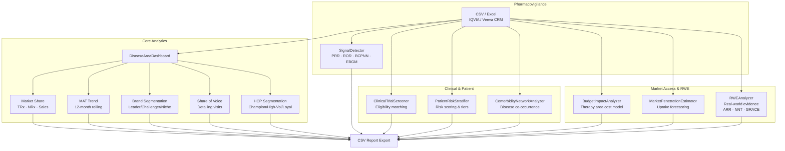

# Disease Area Dashboard

Pharma BI dashboard for disease area market intelligence — brand market share, MAT trend tracking, HCP segmentation, and Share of Voice analytics using IQVIA/Veeva CRM-style data.

## Features

- **Market share analysis** — TRx/NRx/sales share by brand and period
- **MAT trend (Moving Annual Total)** — 12-month rolling totals per brand with YoY growth
- **Brand segmentation** — Leader / Challenger / Niche / Declining tiers via slope regression
- **Share of Voice** — detailing visit share by brand for promotion benchmarking
- **HCP prescriber segmentation** — Champion / High-Volume / Loyal-Mid / Low-Activity / Opportunity
- **Budget impact analysis** — therapy area cost modelling
- **Pharmacovigilance signal detection** — PRR/ROR disproportionality analysis, BCPNN/EBGM Bayesian screening, temporal Poisson scan, subpopulation-stratified signals, and composite priority ranking
- Supports CSV and Excel input (IQVIA, Veeva CRM, in-house formats)

## Tech Stack

| Tool | Purpose |
|---|---|
| **Python 3.9+** | Core language |
| **pandas / numpy** | Data manipulation |
| **scipy** | Statistical segmentation |
| **openpyxl** | Excel file support |
| **pytest** | Unit testing |

## Installation

**Step 1: Clone the repository**
```bash
git clone https://github.com/achmadnaufal/disease-area-dashboard.git
cd disease-area-dashboard
```

**Step 2: Install dependencies**
```bash
pip install -r requirements.txt
```

## Usage

**Step 3: Run the demo**
```bash
python3 demo/run_demo.py
```

**Step 4: Use in your own code**
```python
from src.main import DiseaseAreaDashboard

dash = DiseaseAreaDashboard(config={"therapy_area": "Cardiovascular"})
df = dash.load_data("sample_data/pharma_sales.csv")

share = dash.market_share_analysis(df, metric="trx")
mat   = dash.mat_trend(df, metric="trx")
segs  = dash.brand_segmentation(df)
sov   = dash.calculate_therapy_area_share_of_voice(detailing_df)

# Pharmacovigilance — adverse event signal detection
from src.pharmacovigilance import SignalDetector, AEReport
import pandas as pd

reports = pd.read_csv("sample_data/adverse_event_reports.csv")
detector = SignalDetector()
signals = detector.disproportionality_analysis(reports, min_reports=3)
bayesian = detector.bayesian_screen(reports)
ranked = detector.priority_ranking(signals, top_n=10)
print(ranked.head())
report = detector.generate_report(reports, top_n=20, min_reports=3)
print(report[["drug", "event", "composite_score", "recommended_action"]])
```

**Step 5: Export report**
```python
path = dash.export_report(df, output_path="output/report.csv")
```

## Architecture



## Screenshots / Demo Output

```
$ python3 demo/run_demo.py
==============================================================
  Disease Area Dashboard — Demo (Cardiovascular Therapy Area)
==============================================================

✓ Loaded 16 prescription records
  Brands: ['Cardivance', 'HyperControl', 'Norvalpha', 'Vascuban']
  Periods: 4 months | Channels: 2

✓ Market Share Analysis (TRx) — 2025-04:
  Brand                   TRx    Share %   Rank
  ---------------------------------------------
  Cardivance            4,650      35.3%  #1
  HyperControl          3,300      25.1%  #2
  Norvalpha             3,100      23.5%  #3
  Vascuban              2,120      16.1%  #4

✓ MAT Trend (Moving Annual Total — last period):
  Brand                 MAT TRx    MAT Growth %
  ------------------------------------------------
  Cardivance             17,700             N/A
  HyperControl           12,650             N/A
  Norvalpha              11,870             N/A
  Vascuban                8,050             N/A

✓ Brand Segmentation:
  Brand               Avg Share %   Trend Slope       Segment
  ---------------------------------------------------------
  Cardivance                35.2%        0.0720        Leader
  HyperControl              25.2%       -0.2110         Niche
  Norvalpha                 23.6%        0.0720         Niche
  Vascuban                  16.0%        0.0730         Niche

✓ Share of Voice (Detailing Visits):
  Brand                Visits    SoV %   Rank
  ------------------------------------------
  Cardivance            1,250    40.3%  #1
  HyperControl            840    27.1%  #2
  Norvalpha               620    20.0%  #3
  Vascuban               390    12.6%  #4

==============================================================
  ✅ Demo complete
==============================================================
```

## Testing

```bash
pytest tests/ -v
```

## Contributing

See [CONTRIBUTING.md](CONTRIBUTING.md) for guidelines. PRs welcome — especially IQVIA Symphony Health data format readers, forecast modelling (Prophet/ARIMA), or Streamlit dashboard integrations.

---

> Built by [Achmad Naufal](https://github.com/achmadnaufal) | Lead Data Analyst | Power BI · SQL · Python · GIS
